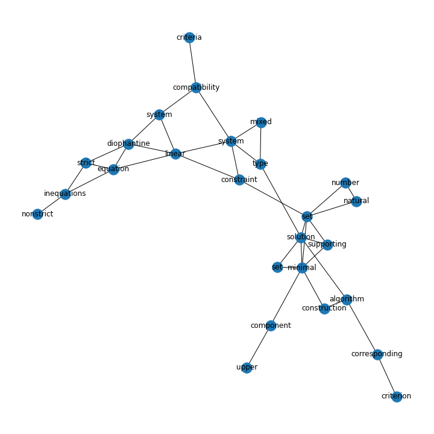

# TextRank for keyword extraction

TextRank is an unsupervised graph-based model that computes importance for each node (potential keyword) by "votes" or "recommendations" from its adjacent nodes. Each node is added to the graph by identifying single words that pass the POS-tag filter (nouns and adjectives only in this implementation). Weight of edges are computed for adjacent word vertices in the document. Upon the constructed graph, we run the PageRank algorithm to exchange votes until convergence, giving ranks for each keyword note. In the post-processing stage, keywords are aggregated into key phrases and computed ranks accordingly, giving the final results.

## Usage

```
python Textrank/textrank.py -h
usage: textrank.py [-h] [-k K] [-window_size WINDOW_SIZE] [-path PATH] [-document DOCUMENT] [-use_spacy]

optional arguments:
  -h, --help            show this help message and exit
  -k K                  number of keyword candidates to extract. default to 10
  -window_size WINDOW_SIZE
                        window size to add edge. default to 2
  -path PATH            path to the lyrics csv file, default to none
  -document DOCUMENT    document to extract keywords from. default to none
  -use_spacy            use spacy language model for preprocessing

sample usage:
python Textrank/textrank.py -k 20 -path "data/lyrics_dataset.csv" -use_spacy
```


## Implementation

### Preprocessing
We perform the standard preprocessing procedure on the document with nltk, including sentence splitting, character cleaning, tokenizing, pos-tagging, lemmatizing and noun-phrase chunk extraction using fixed grammar.

### Graph construction
We used the networkx package for graph operations. Each token that pass the POS-tag filter is added to the graph as a node. For each token within a window size range of a given token in the same sentence, an edge is added with initial weight 1, or incremented by 1 for existing edge between the two corresponding nodes. 

### PageRank
Given a weighted undirected graph, we perform the PageRank algorithm by considering two directed edges with same weight for each undirected edge. The modified PageRank algorithm, taking weights into account, computes a score for each keyword node with the following formula. 

$WS(V_i) = (1 - d) + d \times \sum_{V_j \in In(V_i)} \frac{w_{ji}}{\sum_{V_k \in Out(V_j)} w_{jk}} WS(V_j)$

where $In(V)$ is the set of vertices that points to vertex $V$ and $Out(V)$ the vertices that $V$ points to. The damping factor $d$, between $0$ and $1$, denotes the probability of jumping to another vertex in the original PageRank algorithm of the web-surfing context. Convergence is achieved when the score update for any node from the previous iteration is smaller than a threshold. The top-T (usually one-third of all nodes) keywords are considered candiates for the post-processing phase.


### Post-processing
From single keywords to meaningful key phrases, TextRank proposed to aggregrate adjacent keywords into phrases. In the implementation we greedily select adjacent candiate keywords and sum their scores. 


One limitation we noticed is that the default algorithm could not extract meaningful entity names (e.g. lyrics of *shape of you* from the dataset) by greedily combining adjacent keywords. We referred to the implementation of pytextrank and used its modified post-processing technique by evaluating ranks for meaningful entities extracted in the early preprocessing step.

## Evaluation
Evaluation is done on the [Inspec](https://huggingface.co/datasets/midas/inspec) dataset with 2000 (1000 training, 500 test and 500 valid) abstracts from scientific papers and key phrases annotated by professional indexers.

|    |   precision |   recall |   accuracy | method   | modified   |   window_size | spacy_preprocessing   |
|---:|------------:|---------:|-----------:|:---------|:-----------|--------------:|:----------------------|
|  0 |    0.279819 | 0.263457 |   **0.271391** | textrank | True       |             2 | True                  |
|  1 |    0.276471 | 0.260304 |   0.268144 | textrank | True       |             3 | True                  |
|  2 |    0.276471 | 0.260284 |   0.268133 | textrank | True       |             4 | True                  |
|  3 |    0.250439 | 0.235961 |   0.242985 | textrank | True       |             3 | False                 |
|  4 |    0.250021 | 0.235475 |   0.24253  | textrank | True       |             2 | False                 |
|  5 |    0.247931 | 0.23358  |   0.240542 | textrank | True       |             4 | False                 |
|  6 |    0.215591 | 0.204157 |   0.209719 | spacy    | False      |             2 | False                 |
|  7 |    0.110176 | 0.104078 |   0.10704  | textrank | False      |             4 | False                 |
|  8 |    0.108342 | 0.102322 |   0.105246 | textrank | False      |             3 | False                 |
|  9 |    0.107176 | 0.101212 |   0.104108 | textrank | False      |             2 | False                 |


## Example

> Compatibility of systems of linear constraints over the set of natural numbers. Criteria of compatibility of a system of linear Diophantine equations, strict inequations, and nonstrict inequations are considered. Upper bounds for components of a minimal set of solutions and algorithms of construction of minimal generating sets of solutions for all types of systems are given. These criteria and the corresponding algorithms for constructing a minimal supporting set of solutions can be used in solving all the considered types systems and systems of mixed types.

We perform TextRank on the above text from the orignal paper. 

Preprocessing gives the following tagged tokens and noun-phrases:
```
Compatibility\NN of\IN systems\NNS of\IN linear\JJ constraints\NNS over\IN the\DT set\NN of\IN natural\JJ numbers\NNS
Criteria\NNS of\IN compatibility\NN of\IN a\DT system\NN of\IN linear\JJ Diophantine\NNP equations\NNS ,\, strict\JJ inequations\NNS ,\, and\CC nonstrict\JJ inequations\NNS are\VBP considered\VBN
Upper\NNP bounds\VBZ for\IN components\NNS of\IN a\DT minimal\JJ set\NN of\IN solutions\NNS and\CC algorithms\NN of\IN construction\NN of\IN minimal\JJ generating\VBG sets\NNS of\IN solutions\NNS for\IN all\DT types\NNS of\IN systems\NNS are\VBP given\VBN
These\DT criteria\NNS and\CC the\DT corresponding\JJ algorithms\NN for\IN constructing\VBG a\DT minimal\JJ supporting\NN set\NN of\IN solutions\NNS can\MD be\VB used\VBN in\IN solving\VBG all\PDT the\DT considered\VBN types\NNS systems\NNS and\CC systems\NNS of\IN mixed\JJ types\NNS .\.
```

Constructed graph based on adjacent words with desired tags in the same sentence, along with scores for single words after PageRank algorithm.




```
0.079020: set
0.073893: minimal
0.072940: system
0.069288: solution
0.054190: type
0.049590: linear
0.045612: inequations
0.042323: equation
0.042178: diophantine
0.039866: algorithm
0.036803: compatibility
0.034396: corresponding
0.033589: system
0.033418: strict
0.031552: supporting
0.030758: component
0.030345: constraint
0.026039: construction
0.025154: nonstrict
0.024635: natural
0.024635: number
0.023156: set
0.021196: mixed
0.020386: criterion
0.018841: upper
0.016197: criteria
```

Post-processing with the original greedy merging algorithm gives the following keywords and key phrases.

```
0.184465: minimal supporting set
0.152913: minimal set
0.134091: linear diophantine equation
0.127130: type system
0.110571: supporting set
0.105445: minimal supporting
0.091768: linear diophantine
0.084501: diophantine equation
0.079935: linear constraint
0.079030: strict inequations
```

Using modified post-processing by computing ranks of pre-identified noun phrases, we get the following results.

```
0.166343: linear diophantine equations
0.163355: minimal generating sets
0.161175: mixed types
0.148896: strict inequations
0.148896: nonstrict inequations
0.141017: natural numbers
0.141017: upper bounds
0.141017: linear constraints
0.105762: algorithms
0.096407: a minimal supporting set
```
